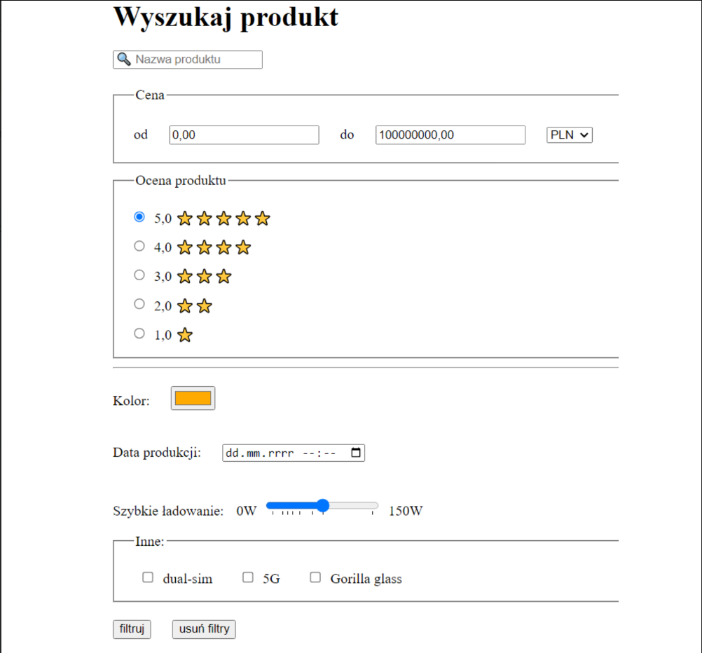

# Lab 2

## Zadanie 1
Utwórz dokument _kontakt.html_ w którym, utworzysz formularz zawierający
imię i nazwisko, numer telefonu, adres email (wykorzystaj odpowiedni
atrybut type), treść wiadomości (wykorzystaj element _textarea_ i atrybuty
_rows_ and _cols_). Pamiętaj o poprawnym zdefiniowaniu elementów label i
ustawieniu atrybutów for a także placeholder.
[link](https://developer.mozilla.org/en-US/docs/Web/HTML/Element/textarea)

## zadanie 2
Do znacznika < form > z poprzedniego zadania dopisz atrybut action o
wartości "" i dopisz atrybut _method_=”get” (jest to domyślna wartość, ale
warto poznać ten atrybut). Ustawienie _action_=”” spowoduje, że formularz
będzie wysyłany przez **dokument do samego siebie**, tutaj stosujemy to
dlatego że **nie napisano serwera**, który obsługiwałby ten formularz, ale
może też być wykorzystywany, aby formularz nie posiadał efektów
ubocznych (ang. side effects). Zwykle podaje się tutaj adres URL serwera
(względny albo bezwzględny), który będzie przetwarzał dane z formularza.
Przeczytaj dokumentację elementu button:
[przycisk](https://developer.mozilla.org/en-US/docs/Web/HTML/Element/button)
Następnie dodaj do formularza dwa przyciski:
- typu submit, którego prawdziwą rolą byłoby wykonanie przesłania
danych formularza do klasycznego serwera np. zaprogramowanego w
PHP, Python, Java, itd.
- typu reset, którego rolą jest zresetowanie elementów formularza do
stanu początkowego m.in. "wyczyszczenie" pól tekstowych,
zresetowanie zaznaczeń pól wyboru; **obecnie nie poleca się**
**stosowania tego przycisku, zwłaszcza gdyby mógł zostać**
**pomylony z wyślij**.
**<span style="color:red">Pamiętaj, aby zastosować atrybut name, inaczej dany element input zostanie zignorowany podczas przesyłania.</span>**

## Zadanie 3

[link](https://developer.mozilla.org/en-US/docs/Web/HTML/Element/select)

Znacznik < select > reprezentuje interaktywny element zawierający wiele
opcji do wyboru zdefiniowanych przy użyciu < option >. **Ważne by**
**zdefiniować atrybut name dla znacznika < select > który będzie**
**odpowiedzialny za wartości wysłane przez ten element formularza.**
<span style="color:red">W znaczniku < option > ważne jest zdefiniowanie atrybutu value który
zostanie użyty jako wartość przesyłana przez formularz. Wartości name i
value utworzą parę klucz wartość przesyłaną jako wybór w formularzu.</span>
Elementy zawarte w liście wyboru można pogrupować używając znacznika
< optgroup > w którym atrybut label będzie etykietą dla danej grupy opcji
wyboru.
Wielokrotny wybór dla danej listy można ustawić za pomocą atrybutu
multiple po którym należy użyć atrybutu size przyjmujący wartość liczbową
będącą liczbą opcji do wybrania.<span STYLE="text-decoration:underline"> Wiele opcji w większości przeglądarek
można wybrać przytrzymując klawisz ctrl i klikając na opcje, które chcemy
wybrać.</span>

```html
<label for="contact-topic">Typ zapytania</label>
<select id="contact-topic" name="contact-topic" multiple size="2">
    <optgroup label="Pytania ogólne">
        <option value="ofer1">Oferta produktów</option>
        <option value="kontakt1">Kontakt z działem obsługi klienta</option>
    </optgroup>
    <optgroup label="Zapytania techniczne">
        <option value="problem1">Problem techniczny z witryną</option>
        <option disabled value="uzytkownik1">Zgłoszenie użytkownika</option>
    </optgroup>
</select>
```
Rozbuduj formularz o listę rozwijaną, z której możliwy będzie wybór 20
miast w Polsce. Pogrupuj miasta według województw. Możliwe jest do
wyboru tylko jedno miasto. **Dwa ostatnie miasta z listy powinny nie**
**być możliwe do wyboru.**

## Zadanie 4
Znacznik < input > którego atrybut type zdefiniujemy na checkbox może
mieć dwa podstawowe stany: zaznaczony i niezaznaczony. <span style="color:red">Istnieje trzeci
stan "indeterminate" który jest używany do kontrolowania grupy
checkboxów. Stan ten oznacza, że co najmniej jedna ale nie wszystkie
dostępne opcje zostały wybrane i można go ustawić jedynie za pomocą
JavaScriptu.</span>

W kontekście checkboxów ważna jest definicja następujących atrybutów:
- checked – obecność tego atrybutu sprawi, że będzie on domyślnie
zaznaczony
- value - wartość, która zostanie przesłana do serwera, jeżeli checkbox
będzie zaznaczony, po przesłaniu formularza
Checkboxy powinny być stosowane w sytuacji, w której chcemy umożliwić
wybór kilku opcji jednocześnie (np. podczas filtrowania wyników
wskazujemy konkretne marki, jakie nas interesują). Co do zasady
dopuszcza się, że żaden z checkboxów w formularzu nie będzie zaznaczony.

```html
<label>
    <input type="checkbox" name="wybor1" value="opcja1"> Opcja 1
</label><br>
<label>
    <input type="checkbox" name="wybor2" value="opcja2"> Opcja 2
</label><br>
<label>
    <input type="checkbox" name="wybor3" value="opcja3"> Opcja 3
</label><br>
<label>
    <input type="checkbox" name="wybor4" value="opcja4"> Opcja 4
</label><br>
<label>
    <input type="checkbox" name="wybor5" value="opcja5"> Opcja 5
</label>
```

Utwórz w formularzu następujące pola wyboru:
- Akceptuję regulamin serwisu
    - **Pole powinno być domyślnie zaznaczone bez możliwoś**ci
**jego odznaczenia. Pole jest wymagane.**

- Subskrybuj newsletter

## Zadanie 5

[Radio button](https://developer.mozilla.org/en-US/docs/Web/HTML/Element/input/radio)

Kolejny typ znacznika _< input >_ to _radio_. Pozwala on na stworzenie grupy
pól wyboru z których możliwe jest zaznaczenie tylko jednej opcji. Te same
wartości atrybutu name tworzą grupę, z której możliwe jest wybranie tylko
jednej opcji i zmiana zaznaczenia jednego z tych elementów automatycznie
odznacza poprzednio zaznaczony. <span style="color:red">Ważne jest dodanie atrybutu value
którego wartość będzie przesyłana do serwera. </span>Technicznie możliwe jest,
że formularz będzie tak utworzony, że możliwe będzie niezaznaczenie
żadnej z opcji.

```html
<label>
    <input type="radio" name="wybor" value="opcja1"> Opcja 1
</label><br>
<label>
    <input type="radio" name="wybor" value="opcja2"> Opcja 2
</label><br>
<label>
    <input type="radio" name="wybor" value="opcja3"> Opcja 3
</label><br>
<label>
    <input type="radio" name="wybor" value="opcja4"> Opcja 4
</label><br>
<label>
    <input type="radio" name="wybor" value="opcja5"> Opcja 5
</label>
```

Utwórz w formularzu grupę przycisków która będzie odpowiedzialna za
wybranie jednej spośród następujących opcji:
- Zgłoszenie problemu technicznego
- Propozycja współpracy
- Pytania dotyczące treści
- Zgłoszenie nadużycia

## Zadanie 6

Znacznik _< fieldset >_ służy do grupowania kilku elementów formularza w
grupy tematyczne. Znacznik < legend > wewnątrz znacznika < fieldset >
definiuje opis danej grupy elementów interaktywnych. Zwykle przeglądarki
automatycznie obramowują ten element, choć jego wygląd należy
definiować za pomocą CSS.

[Fildset](https://developer.mozilla.org/en-US/docs/Web/HTML/Element/fieldset)

Pogrupuj elementy formularza według kategorii:
- Zgody na przetwarzanie danych
- Powód zgłoszenia
- Informacje o użytkowniku

## Zadanie 7

Zapoznaj się z pozostałymi typami input:

[Input types](https://developer.mozilla.org/en-US/docs/Web/HTML/Elementinput#input_types)

Następnie w bieżącym dokumencie utwórz sekcję umożliwiającą stworzenie
konta w serwisie. W tej sekcji umieść formularz, w którym wykorzystasz
poznane wcześniej znaczniki a ponadto:
1. _date_ (data urodzenia)
2. _file_ (obraz - avatar)
3. _password_ (_hasło konta_)
4. _color_ (preferowany kolor motywu)

Następnie utwórz sekcję, w której możliwe będzie zakupienie biletu na
pociąg. W formularzu wykorzystaj:
1. _date_ (data odjazdu)
2. _time_ (godzina odjazdu)
3. _search_ (wyszukiwanie miasta)
4. _range_ (liczba biletów od 1 do maksymalnie 10)

## Zadanie 8
W celu ograniczenia możliwości przesłania na serwer błędnych danych,
stosuje się walidację (sprawdzenie poprawności uzupełnienia) formularza.
**Może być ona (i powinna być) wykonywana i po stronie klienta i po**
**stronie serwera.**
Niektóre elementy formularza automatycznie dodają reguły walidacji (np.
typ email konieczność obecności znaku @). Wymagania dotyczące walidacji
dodajemy za pomocą atrybutów. Najbardziej złożone, ale też i ogólne
wymagania dotyczące danego pola można uzyskać za pomocą atrybutu
pattern.
[link](https://developer.mozilla.org/en-US/docs/Web/HTML/Attributes/pattern )

Korzystając z dokumentacji dostępnej na [input](https://developer.mozilla.org/en-US/docs/Web/HTML/Element/input) (również z zakładek validation dla

danego typu input) ustal następujące wymagania:
- W pole imię i nazwisko możliwe było wpisanie imienia i nazwiska bez
możliwości wpisania cyfr a także znaków specjalnych. Muszą być
wpisane co najmniej 4 znaki.
- W pole numer telefonu jest wymagane i przyjmuje tylko numery
telefonów w postaci +XX XXX XXX XXX gdzie X to cyfry od 0 do 9.
- Treść wiadomości musi mieć co najmniej 20 znaków.
- Można załączyć jedynie pliki pdf.
- Nie można wybrać daty niższej niż dzisiejsza i późniejszej niż 3
miesiące do przodu (stosowane np. do zakupu biletów w komunikacji
publicznej)
- Liczba sztuk musi być większa od 0 i jednocześnie nie może być
ułamkiem dziesiętnym
Przetestuj działanie zdefiniowanych reguł walidacyjnych. Przy próbie
wysłania formularza wciskając przycisk z atrybutem type=submit w
przeglądarce powinny pokazać się dymki z opisanym powodem błędu
walidacji.
Sprawdź czy po poprawnym przesłaniu w adresie URL znajdują się wszystkie
wartości wybrane wcześniej w formularzu i czy ich nazwy są zdefiniowane
w sposób umożliwiający czego dotyczy dana wartość.

## Zadanie 9
Odwzoruj formularz zaprezentowany poniżej. Pamiętaj o ustawieniu
wszystkich potrzebnych atrybutów: id, for, value, name.
Wykorzystaj następujące symbole graficzne (mogą się renderować różnie w
zależności od czcionki, czy miejsca gdzie je wyświetlamy, ale to znaki UTF):



W przeglądarce Google Chrome zainstaluj rozszerzenie:[link](https://chrome.google.com/webstore/detail/screen-reader/kgejglhpjiefppelpmljglcjbhoiplfn?utm_source=ext_sidebar&hl=pl)

I upewnij się, że jest aktywne Screen Reader
Klikaj następnie w utworzone elementy. Jakie powstały korzyści z
ustawiania atrybutów i etykiet? Porównaj działanie czytnika ekranu na
formularzu, w którym nie ma etykiet, ani atrybutów value w checkboxach,
radiobuttonach albo option.