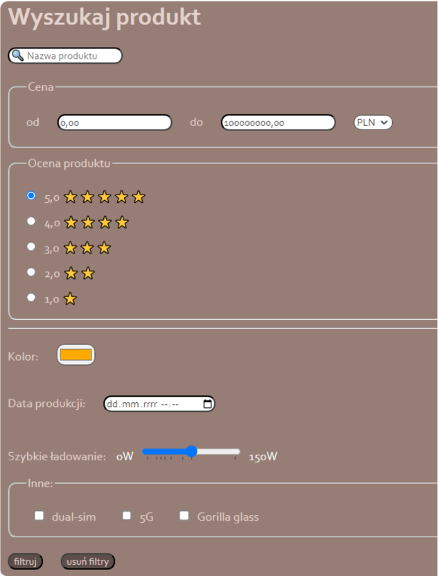
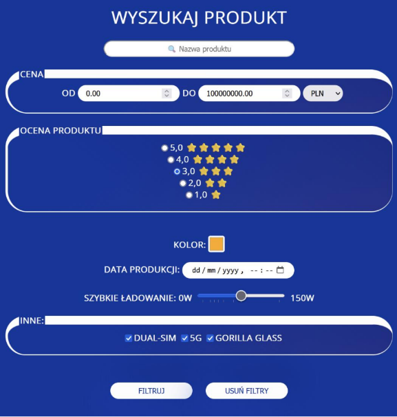

# Lab 3

### Zadanie 1

Skopiuj poniższy przykład:

```html
<!DOCTYPE html>
<html>

<head>
    <title>Podstawy CSS</title>
    <style>
        p {
            color: red;
            /* komentarz w CSS */
        }
    </style>
</head>

<body>
    <p>Ten akapit będzie w czerwonym kolorze.</p>
    <p>Ten również.</p>
    <p>Jak i każdy inny.</p>
</body>

</html>
```

1. Do drugiego akapitu dodaj atrybut style i zmień kolor tekstu na zielony.
2. Dodaj do dokumentu HMTL element _h1_ o treści "Akapity w CSS" i
następnie dopisz odpowiedni selektor, który ustawi kolor na pomarańczowy
i doda podkreślenie tekstu.
3. Dodaj do dokumentu HTML element _p_, któremu nadasz id="special" i
następnie dopisz odpowiedni selektor, który tylko temu elementowi zmieni
kolor tła na jasno-żółty a kolor tekstu na czarny.
4. Dodaj do stylu klasę _example_, która definiuje czcionkę typu italic,
padding 10px i margin 50px. Następnie dodaj kolejny element _p_, któremu
ustawisz tę klasę jako aktywną. Następnie dodaj element _span_, któremu
również ustawisz tę klasę.
**Pamiętaj, aby elementy nie miały pustych zawartości, tak aby**
**wizualnie widzieć efekty stylowania.**

### Zadanie 2

Utwórz **poprawny** dokument HTML, po czym umieść w sekcji head
następujące reguły:

```CSS
body {
    width: 400px;
    height: 200px;
    margin: 0 auto;
    background-color: #b8ebc3;
    padding: 0 20px 20px 20px;
    border: 5px solid black;
}
img {
    max-width: 20px;
    max-height: 20px;
}
section {
    border: 1px solid red;
}
span {
    background-color: aqua;
}
```

Zancznik body ma zawierać:

```html
<body>
    <section>Lorem ipsum</section>
    <section>Lorem ipsum <span>abc</span></section>
    <section>Lorem ipsum </section>
</body>
```
Obraz niech będzie miał co najmniej 200x200px.

1. Włącz narzędzia deweloperskie (F12 albo Fn + F12) i następnie
odznaczaj kolejno właściwości w selektorze body. Obserwuj jaki ma
to wpływ na zachowanie modelu pudełkowego.

2. Następnie zmodyfikuj selektor _img_, tak, aby rozmiar zdjęcia był
maksymalnie dwukrotnie większy (czyli 40x40px). Jaki wpływ ta
zmiana ma na model pudełkowy rodzica tego elementu?

3. Następnie ustaw dokładny rozmiar obrazka na 200x200px. Co się
wydarzyło? Następnie usuń z selektora body właściwości _width_ i
_height_, jaki jest tego efekt?

4. Zmodyfikuj właściwości _padding_ i _margin_ dla selektora _span_, czy
potrafisz wytłumaczyć skąd taki wynik renderingu?

5. Do tej samej sekcji dodaj element div i również ustaw za pomocą
selektora _padding_ i _margin_. Jaki tym razem jest efekt?

6. Do znacznika body dodaj właściwość box-sizing: border-box; Jaką
zmianę to spowodowało?

7. Ustaw w selektorze _span_ kolejno następujące wartości właściwości
_display_:

```CSS
display: inline; /* domyślna wartość dla span */
display: block;
display: inline-block;
```

Jaki wpływ mają one na model pudełkowy zarówno elementu _span_, jak i
jego rodzica?

### Zadanie 3

Odwzoruj formularz z poprzednich zajęć laboratoryjnych, jednak tym razem
niech wygląda w sposób zaprezentowany poniżej. Wykorzystaj zewnętrzny
arkusz stylu.
Wykorzystano następujące właściwości:
Kolory:
- 414141
- fbfbfb
- 5d4e49
- e4d3ce
Czcionka:
- Corbel



Następnie napisz kolejny arkusz styli i tym razem niech ten formularz
prezentuje się tak jak pokazano poniżej:
Kolory:
- fefefe
- 0033A0
Czcionka:
- Open Sans



### Zadanie 4
Skopiuj poniższy przykład. Zapoznaj się z artykułem na temat dziedziczenia
w [CSS](https://developer.mozilla.org/en-US/docs/Web/CSS/Inheritance).
Następnie zmodyfikuj przykład, tak, aby:
1. Element p odziedziczył jednak wartość właściwości border.
2. Element p posiadał domyślne wartości wszystkich właściwości.
Wykorzystaj specjalną właściwość _all_.
3. Element p posiadał wszystkie właściwości takie same jak rodzic.
Ponownie wykorzystaj _all_.

```html
<!DOCTYPE html>
<html lang="en">

<head>
    <meta charset="UTF-8">
    <meta name="viewport" content="width=device-width, initial-scale=1.0">
    <title>CSS Inheritance</title>
    <style>
        section {
            border: 1px dashed red;
            color: red;
        }
    </style>
</head>

<body>
    <section>
        Ten element będzie obramowany i będzie posiadał
        czerwoną czcionkę.
        <p>
            Ten element nie będzie obramowany, ale będzie
            posiadał czerwoną czcionkę.
        </p>
    </section>
</body>

</html>
```
### Zadanie 5
Następnie utwórz arkusz styli o nazwie _cascade_example.css_.

```CSS
section {
border: 5px solid orange;
color: white;
}
```
1. Załącz ten styl za pomocą elementu _link_ w elemencie head **przed**
elementem _style_. Jaki jest teraz efekt renderingu dokumentu? W
narzędziach deweloperskich zaglądnij w sekcje z regułami stylowania dla
elementu _section_; co obserwujesz?
2. Następnie przenieś element link **poniżej** _style_. Co tym razem
obserwujesz?
3. Do arkusza dopisz deklarację:

```CSS
background-color: black;
```

Jaki jest teraz efekt wstawienia arkusza zarówno przed, jak i po elemencie
style?
4. Zmodyfikuj arkusz w ten sposób:

```CSS
border: 5px solid orange !important;
```

Jaki jest teraz efekt wstawienia arkusza zarówno przed, jak i po elemencie
style?
5. Do elementu section dopisz atrybut:

```CSS
style="color: #000;"
```

Jaki jest teraz efekt wstawienia arkusza zarówno przed, jak i po elemencie
style?
6. Korzystając z [tutorial](https://www.thoughtco.com/user-style-sheet-3469931) dodaj do przeglądarki styl użytkownika i zmień wartość

właściwości _color_ na inną niż stosowane w poleceniu; ponadto ustaw
wartość właściwości _padding_ na 100px. **Preferowany jest Chrome, który**
**korzysta z rozszerzenia, aby wprowadzone zmiany nie zostały**
**wprowadzone trwale!** Jaki efekt przyniosły te zmiany? Pomocne w
odpowiedzi może być korzystanie z narzędzi deweloperskich, jak i
sprawdzenie efektu z i bez zastosowania inline stylu.

### Zadanie 6

Zdefiniuj poprawny HTML, gdzie w elemencie body znajduje się:

```html
<ul class="nav">
    <li class="nav-item">Home</li>
    <li class="nav-item">About</li>
    <li class="nav-item">Contact</li>
</ul>
```
i jednocześnie zdefiniowano następujący styl:

```CSS
li {
    color: red;
}
ul > li {
    color: blue;
}
.nav-item {
    color: green;
}
```
1. Jaki jest efekt renderingu tego elementu? Czy wiesz co spowodowało taki
efekt?
2. Najeżdżając na dany selektor w VSCode wyświetlana jest jego
specyficzność.
Możesz też skorzystać z kalkulatora specyficzności online (dla utrwalenia
zasad obliczania specyficzności: [link](https://specificity.keegan.st/)).
Sprawdź specyficzność elementów. Który z nich jest "najmocniejszy"?
3. Zmodyfikuj arkusz CSS na następujący:

```CSS
#nav > .nav-item:hover {
    color: pink;
}
#nav > li:hover {
    color: brown;
}
li.nav-item:hover {
    color: orange;
}
```

Jednocześnie zastąp w elemencie ul klasę _nav_ id="nav". Ponownie oblicz za
pomocą kalkulatora specyficzność selektorów. Podaj kolejność ich "mocy".
4. Rozważ następujące reguły:

```CSS
h1 {
    font-size: 60pt;
}
#thisOne {
    color: brown;
}
#thisOne h1 {
    font-size: 60pt;
    color: chocolate;
}
#thatOne {
    color: black;
    font-size: 10pt;
}
button {
    background-color: chocolate;
    color: beige;
    border: 0px;
    border-radius: 10px;
}
#thirdOne {
    color: black;
    font-weight: bold;
}
#btn-light {
    color: chocolate;
    background-color: beige;
    border: 0px;
    border-radius: 10px;
}
section p {
    color: black;
    font-family: Corbel;
}
```

Służą one do stylowania następującego fragmentu dokumentu HTML:

```html
<section id="thisOne">
    <h1>Header</h1>
    <button>przycisk</button>
    <p id="thatOne">
        To jest akapit.
    </p>
</section>
<section style="border: #000 solid 2px;">
    <h1>Header</h1>
    <button>inny przycisk</button>
</section>
<p id="thirdOne">
    To jest kolejny akapit.
</p>
<section>
    <button id="btn-light">inny przycisk</button>
    <p>
        To jest trzeci akapit.
    </p>
</section>
```

1. Czy Twoim zdaniem reguły są napisane w sposób optymalny?
2. Zastąp reguły zastosowane powyżej, w taki sposób, aby dokument
renderował się tak samo, ale selektory były prostsze i nie było powtarzania
redundantnych właściwości. Identyfikator _btn-light_ zastąp klasą o takiej
samej nazwie. Zrezygnuj ze stosowania inline style. Wykorzystaj wiedzę na
temat specyficzności i dziedziczenia.

### Zadanie 6
Zdefiniuj style css które będą powodować, że:
- Dodanie do tabeli klasy "row-stripes" spowoduje, że parzyste wiersze
w tabeli będą miały kolor #73BBE6. Jeśli tabela posiada nagłówki
będą one miały tło w kolorze 666652.
- Dodanie do tabeli klasy "col-stripes" spowoduje, że parzyste kolumny
w tabeli będą miały kolor 73BBE6. Jeśli tabela posiada nagłówki
będą one miały tło w kolorze 666652.
Dodanie klasy powinno zadziałać na tabelę o dowolnej wielkości.
Przetestuj działanie stylu na następującej tabeli:

|nagłówek|nagłówek2|nagłówek3|
|--------|---------|---------|
|1|wartość 1|technologie|
|2|wartość 2|internetowe|