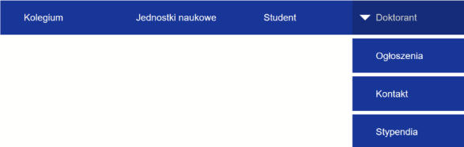
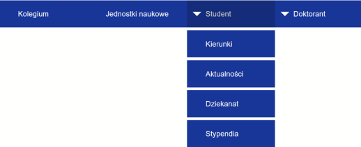
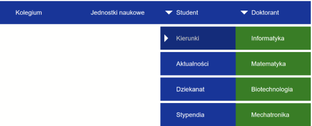
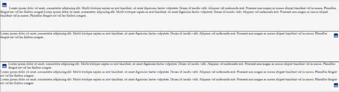
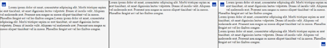
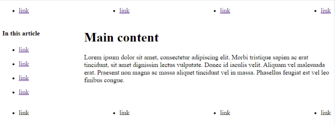
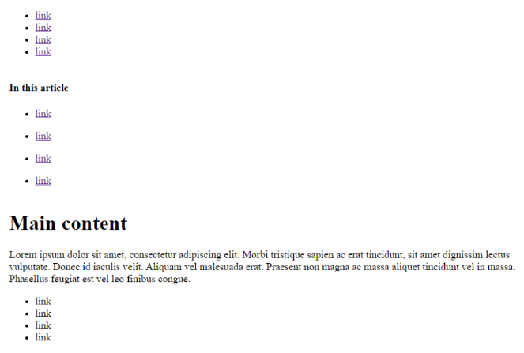

# Lab 4

### Zadanie 1

Skopiuj kod:

```html
<!DOCTYPE html>
<html lang="en">
<head>
    <meta charset="UTF-8">
    <meta name="viewport" content="width=device-width, initial-scale=1.0">
    <title>Document</title>
    <link rel="stylesheet" href="units.css">
</head>
<body>
    <div class="cm">cm</div>
    <div class="mms">10 mm</div>
    <div class="inchascm">2.54cm</div>
    <div class="inchasmm">25.4mm</div>
    <div class="inch">inch</div>
    <div class="pxs96">96pxs</div>
    <div class="pts72">72pts</div>
    <div class="pcs6">6pcs</div>
</body>
</html>
```

style CSS:

```CSS
        .cm {
            width: 1cm;
            height: 1cm;
            background-color: blanchedalmond;
        }

        .inchascm {
            width: 2.54cm;
            height: 2.54cm;
            background-color: aqua;
        }

        .inchasmm {
            width: 25.4mm;
            height: 25.4mm;
            background-color: antiquewhite;
        }

        .mms {
            width: 10mm;
            height: 10mm;
            background-color: aliceblue;
        }

        .inch {
            width: 1in;
            height: 1in;
            background-color: aquamarine;
        }

        .pxs96 {
            width: 96px;
            height: 96px;
            background-color: azure;
        }

        .pts72 {
            width: 72pt;
            height: 72pt;
            background-color: beige;
        }

        .pcs6 {
            width: 6pc;
            height: 6pc;
            background-color: bisque;
        }
```

1. Co możesz powiedzieć o wzajemnych relacjach pomiędzy jednostkami
w CSS?


2. Dopisz do arkusza styli media query typu print, gdzie wszystkim
elementom HTML ustawisz poprawnie właściwość print-color-adjust:

[link](https://developer.mozilla.org/en-US/docs/Web/CSS/print-color-adjust) na exact. Zwróć uwagę, że nie wszystkie przeglądarki

wspierają tę właściwość bez prefiksu

[link](https://developer.mozilla.org/en-US/docs/Web/CSS/print-color-adjust#browser_compatibility).

3. Wydrukuj stronę (najszybciej za pomocą Ctrl+P) za pomocą
przeglądarki i zapisz ją jako pdf.

Gdyby nie użyto exact, przeglądarka usunęłaby kolory tła.
4.  Za pomocą linijki w przeglądarce pdf możesz sprawdzić długość 1cm
oraz 1 cala (tj. zweryfikować czy odpowiada jednostce metrycznej).
5.  Jeżeli dysponujesz linijką, również możesz sprawdzić długość 1cm
oraz 1 cala, wyświetloną na ekranie.

### Zadanie 2

Skopiuj kod html:

```html
<!DOCTYPE html>
<html>

<head>
    <meta charset="UTF-8" />
    <title>title</title>
    <style>
        .parent {
            font-size: 16px;
        }

        .child-one {
            font-size: 1.5em;
        }

        .child-two {
            font-size: 1.5em;
        }

        .child-three {
            font-size: 2em;
        }
    </style>
</head>

<body>
    <div class="parent">
        <div class="child-one">1</div>
        <div class="child-two">2</div>
        <div class="child-three">3</div>
    </div>
</body>

</html>
```

1. Zmień rozmiar czcionki w klasie _parent_ na 20px, jaki dało to efekt?
2. Dodaj nadrzędnemu elementowi _div_ kolejny element div, któremu
ustawisz _width_: 5em i obramowanie. W narzędziach deweloperskich
zobacz jaki jest rozmiar elementu.
3. Przenieś element div utworzony w punkcie 2. jako dziecko elementu
o klasie *„child-one”*. Jaki jest teraz rozmiar elementu w pikselach?
4. Ponownie przenieś ten element, tym razem jako dziecko elementu o
klasie _„child-three”_. Jaki jest teraz rozmiar elementu w pikselach?
5. Zmień wszystkie jednostki em na rem. Jak zachowują się tym razem
elementy w sytuacjach z punktów 2.-4.?
6. Dodaj regułę, w której ustawisz _font-size_ elementowi _html_ na 24px;
jednocześnie dopisz elementowi div o klasie _„parent”_ tekst parent.
Jaki dało to efekt?

### Zadanie 3

Utwórz następujący pasek menu:


Do utworzenia strzałek użyj pseudo-elementu ::after w którym:
- Właściwość content ustawisz na pustą treść
- Właściwość border ustawisz tak by ramka była szeroka na 10px oraz
przezroczysta
- Za pomocą właściwości border-top w kolorze białym utworzysz
strzałkę w odpowiednim kierunku
- Wykorzystując właściwość position oraz top, left odpowiednio
ustawisz miejsce elementu
[Pozycja](https://developer.mozilla.org/en-US/docs/Web/CSS/position)

### Zadanie 4

Rozbuduj menu tak by po najechaniu na element pojawiały się następujące
opcje, natomiast po zabraniu kursora znikały.



Elementy tworzące pod-menu mogą być wyświetlone jako elementy
blokowe oraz początkowo mieć ustawioną właściwość opacity na wartość 0.
Po najechaniu myszą elementy zmieniają _opacity_ na 1.

### Zadanie 5

Zmodyfikuj reguły CSS, aby w jak najprostszy sposób można było utworzyć
menu składające się z kolejnych rozwijanych menu. Zredukuj liczbę reguł
css na tyle ile to możliwe.



### Zadanie 6

Utwórz opcję dodania kolejnego menu rozwijanego z lewej lub prawej
strony w zielonym kolorze.



Zapoznaj się z dokumentacją:
[menu](https://developer.mozilla.org/en-US/docs/Web/CSS/pointer-events)
A następnie dodaj odpowiednie właściwości tak aby elementy niewidoczne
nie blokowały wyboru opcji Informatyka w utworzonym menu. Bez tych
właściwości obecne menu po najechaniu na informatyka może pokazywać
opcję z menu Doktorant.

### Zadanie 7

Korzystając z dokumentacji
[Ułożenie treści](https://developer.mozilla.org/en-US/docs/Web/CSS/float)
[Czyszczenie](https://developer.mozilla.org/en-US/docs/Web/CSS/clear)
1. odwzoruj następujący układ treści:

Dla uściślenia: wykorzystano element _article_, który zawiera elementy
section. Elementy _section_ są obramowane i posiadają kolor tła _whitesmoke_.
Rozmiar zdjęcia ustalono na 40x40px. Elementom _section_ ustawiono _heigth_
150px.
Tekst lorem ipsum wykorzystany w przykładzie:

```text
Lorem ipsum dolor sit amet, consectetur adipiscing elit, sed do eiusmod tempor incididunt
ut labore et dolore magna aliqua. Ut enim ad minim veniam, quis nostrud exercitation
ullamco laboris nisi ut aliquip ex ea commodo consequat. Duis aute irure dolor in
reprehenderit in voluptate velit esse cillum dolore eu fugiat nulla pariatur. Excepteur sint occaecat cupidatat non proident, sunt in culpa qui officia deserunt mollit anim id est
laborum.
```
2. Następnie spróbuj za pomocą float uzyskać 3-kolumnowy układ treści.
W tym celu dopisz elementom section _float:left_ i _width: 33%_. Jaki jest
tego efekt?
3. Czy usunięcie height: 150px rozwiązało problem?
4. Aby zobaczyć, że istnieje dużo lepszy sposób na uzyskanie tego efektu
niż użycie _float_, usuń elementom section _float: left_ i _width: 33%_
natomiast dopisz elementowi article _display: flex_. Efekt powinien być
następujący.



Z uwagi na złożoność flexa zostanie on dokładnie omówiony w kolejnej
instrukcji; tutaj ma on głównie znaczenie pokazowe.

### Zadanie 8

Wykorzystując media query:
- ustal taki układ dla dużych ekranów (umownie powyżej 768px szerokości)

- ustal taki układ dla małych ekranów (umownie poniżej 768px szerokości)


### Zadanie 9
Za pomocą @layer utwórz 3 warstwy CSS: pierwsza, druga i trzecia; nadaj
im taką samą kolejność. Ustaw kolor czcionki odpowiednio na czarny,
czerwony i niebieski dla elementu _section_ w każdej warstwie. Następnie
utwórz poprawny dokument HTML i utwórz element _section_.
1. Jaki kolor czcionki jest aktywny? Czy wiesz dlaczego tak jest?
2. Poza warstwami ustaw kolor czcionki na zielony dla section. Zaglądnij
do narzędzi deweloperskich i zobacz na kolejność reguł stylowania.
3. Utwórz zewnętrzny arkusz CSS: _external.css_, gdzie utworzysz
warstwę o nazwie _zerowa_. Niech ustawi ona kolor czcionki section na
brązowy. Zaimportuj ten arkusz do bieżącego za pomocą @import.
Niech będzie to pierwsza instrukcja w CSS. Jaką kolejność przyjęła
domyślnie warstwa zerowa?
4. Deklarację z kolejnością warstw przenieś tym razem przed @import i
ustaw warstwę zerowa jako _najważniejszą_.
5. W warstwie pierwszej dodaj !important do wartości _color_.
6. Do _external.css_ poza warstwą zerowa ustaw kolor section na żółty.
Która w hierarchii kaskady jest ta definicja?

### Zadanie 10
Zadanie 10.
Element section z poprzedniego zadania kolejno:
1. Obróć o 10 stopni.
2. Przeskaluj 200%.
3. Rozmaż (blur)
4. Ustaw kolor czcionki na półprzeźroczysty niebieski.
5. Ustaw mu padding jako 1em – 5px;
**Wykorzystaj funkcje CSS.**