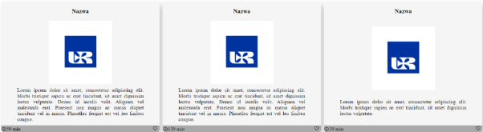
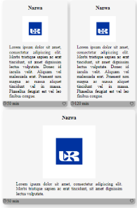
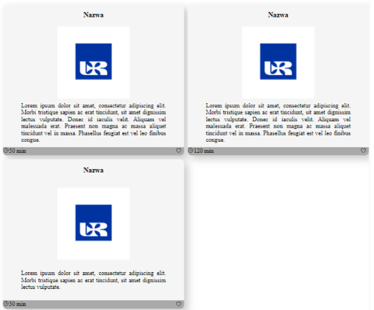

# Lab 5

### Zadanie 1

W celu interaktywnego zapoznania się z możliwościami flexboxa uruchom
następującą aplikację internetową: [żabki](https://flexboxfroggy.com/#pl) i rozwiąż

wszystkie zadania. Możesz posiłkować się poradnikiem: [flexbox](https://css-tricks.com/snippets/css/a-guide-to-flexbox/).

### Zadanie 2
Do następującego dokumentu HTML dopisz style, aby uzyskać efekt, jak na
obrazku poniżej:

Wykorzystaj właściwości _flex-direction_, _gap_, _align-items_, _justify-content_,
flex. W przykładzie zastosowano też zewnętrzny moduł, który dodaje
zestaw gotowych ikon. Generalnie zagnieżdżaj układ oparty o flexbox w
poszczególnych elementach. Zauważ, że ostatnia karta teoretycznie, mimo
że posiada mniej treści, jest wyrównana z rozmiarem pozostałych dwóch
kart; uzyskaj taki sam efekt.

```html
<!DOCTYPE html>
<html>

<head>
    <meta charset="UTF-8" />
    <title>title</title>
    <script type="module" src="https://unpkg.com/ionicons@7.1.0/dist/ionicons/ionicons.esm.js">
    </script>
</head>

<body>
    <div class="container">
        <div class="card">
            <h3>Nazwa</h3>
            
            <div class="main-text">
                Lorem ipsum dolor sit amet, consectetur adipiscing elit. Morbi tristique sapien
                ac erat tincidunt, sit amet dignissim lectus vulputate. Donec id iaculis velit.
                Aliquam vel malesuada erat. Praesent non magna ac massa aliquet tincidunt vel in
                massa. Phasellus feugiat est vel leo finibus congue.
            </div>
            <div class="bottom"><span><ion-icon name="time-outline"></ion-icon>
                    50 min</span> <button><ion-icon name="heart-outline"></ion-icon></button></div>
        </div>
        <div class="card">
            <h3>Nazwa</h3>
            
            <div class="main-text">
                Lorem ipsum dolor sit amet, consectetur adipiscing elit. Morbi tristique sapien
                ac erat tincidunt, sit amet dignissim lectus vulputate. Donec id iaculis velit.
                Aliquam vel malesuada erat. Praesent non magna ac massa aliquet tincidunt vel in
                massa. Phasellus feugiat est vel leo finibus congue.
            </div>
            <div class="bottom"><span><ion-icon name="time-outline"></ion-icon>
                    120 min</span> <button><ion-icon name="heart-outline"></ion-icon></button></div>
        </div>
        <div class="card">
            <h3>Nazwa</h3>
            
            <div class="main-text">
                Lorem ipsum dolor sit amet, consectetur adipiscing elit. Morbi
                tristique sapien ac erat tincidunt, sit amet dignissim lectus vulputate.
            </div>
            <div class="bottom"><span><ion-icon name="time-outline"></ion-icon> 30 min</span>
                <button><ion-icon name="heart-outline"></ion-icon></button>
            </div>
        </div>
    </div>
</body>

</html>
```

### Zadanie 3
Do przykładu z poprzedniego zadania:
1. Najpierw skopiuj jeszcze dwie karty. Jaki spowodowało to efekt?
2. W klasie _.container_ ustaw _max-width:500px_ i jednocześnie w klasie
_.card_ ustaw _min-width: 200px_.
3. Ustaw teraz w klasie _container overflow-x: scroll_. Jaki dało to efekt?
Rozwiązanie to bywa wbrew pozorom stosowane w układach na
urządzenia mobilne, jednak tam dla estetyki zwykle ukrywa się scroll.
Można to uzyskać w następujący sposób:

```CSS
.container::-webkit-scrollbar {
    display: none;
} /* większość przeglądarek */
.container {
    scrollbar-width: none;/*firefox */
}
```

4. Ustaw teraz w klasie _container flex-wrap: wrap_ i jednocześnie usuń
właściwość _overflow_. Jeżeli posiadamy 3 karty (jak było wyjściowo),
możliwy jest następujący rezultat (zależy on od właściwości flex):

Jest to spowodowane tym, że ostatni element zajmie całe dostępne miejsce
w kontenerze. Żeby zapobiec tego typu układowi treści można wykorzystać
następujące właściwości CSS w klasie _.card_:
5. Zaproponuj inne rozwiązanie powyższego problemu w oparciu o _min-width_ i _max-width_, ponadto ustaw elementom globalnie równą wysokość. _Alternatywne rozwiązanie powyższego problemu za pomocą grid zostanie również pokazane w dalszej części instrukcji_.

### Zadanie 4

Skopiuj następujący przykład:

```html
<!DOCTYPE html>
<html lang="en">

<head>
    <meta charset="UTF-8">
    <meta name="viewport" content="width=device-width, initial-scale=1.0">
    <title>Flexbox intro</title>
</head>
<style>
    * {
        box-sizing: border-box;
    }

    .take-all-space {
        display: flex;
        flex-direction: column;
        justify-content: space-between;
        min-width: 100vw;
        min-height: 100vh;
        margin: 0px;
    }

    .main-content {
        display: flex;
        flex-direction: row;
        flex-grow: 2;
        align-items: stretch;
    }

    .main-section {
        display: flex;
        flex-direction: column;
        align-items: center;
    }

    .main-section section {
        padding: 10px;
        max-width: 70%;
        text-align: center;
    }

    .navbar {
        background-color: #313131;
    }

    .navbar-links {
        display: flex;
        flex-direction: row;
        list-style-type: none;
        justify-content: space-evenly;
        padding: 0px;
    }

    .navbar-links li a {
        color: #fff;
        text-decoration: none;
        padding: 5px;
    }

    .aside {
        background-color: #8e8c8c;
        min-width: 25%;
        display: flex;
        flex-direction: column;
        align-items: center;
        text-align: justify;
    }

    .aside ul {
        display: flex;
        flex-direction: column;
        list-style-type: none;
        justify-content: space-evenly;
        padding: 0px;
    }

    .aside li a {
        color: #fff;
        text-decoration: none;
        padding: 5px;
    }

    .footer {
        background-color: #313131;
    }

    .footer-links {
        display: flex;
        flex-direction: row;
        list-style-type: none;
        justify-content: space-evenly;
        padding: 0px;
    }

    .footer-links li a {
        color: #fff;
        text-decoration: none;
        padding: 5px;
    }
</style>

<body class="take-all-space">
    <nav class="navbar">
        <ul class="navbar-links">
            <li><a href="#">Strona główna</a></li>
            <li><a href="#">Podstrona 1</a></li>
            <li><a href="#">Podstrona 2</a></li>
            <li><a href="#">Podstrona 3</a></li>
        </ul>
    </nav>
    <div class="main-content">
        <aside class="aside">
            <h2>Mapa strony</h2>
            <ul>
                <li><a href="#">link1</a></li>
                <li><a href="#">link2</a></li>
                <li><a href="#">link3</a></li>
                <li><a href="#">link4</a></li>
            </ul>
        </aside>
        <div class="main-section">
            <h1>Strona główna</h1>
            <section>
                Lorem ipsum dolor sit amet, consectetur adipiscing elit. Morbi tristique sapien
                ac erat tincidunt, sit amet dignissim lectus vulputate. Donec id iaculis velit.
                Aliquam vel malesuada erat. Praesent non magna ac massa
                aliquet tincidunt vel in massa. Phasellus feugiat est vel leo finibus
                congue.Lorem ipsum dolor sit amet, consectetur adipiscing elit. Morbi tristique
                sapien ac erat tincidunt, sit amet dignissim lectus vulputate. Donec id
                iaculis velit. Aliquam vel malesuada erat. Praesent non magna ac massa
                aliquet tincidunt vel in massa. Phasellus feugiat est vel leo finibus
                congue.</section>
            <section>
                Lorem ipsum dolor sit amet, consectetur adipiscing elit. Morbi tristique sapien
                ac erat tincidunt, sit amet dignissim lectus vulputate. Donec id iaculis velit.
                Aliquam vel malesuada erat. Praesent non magna ac massa
                aliquet tincidunt vel in massa. Phasellus feugiat est vel leo finibus
                congue.Lorem ipsum dolor sit amet, consectetur adipiscing elit. Morbi tristique
                sapien ac erat tincidunt, sit amet dignissim lectus vulputate. Donec id
                iaculis velit. Aliquam vel malesuada erat. Praesent non magna ac massa
                aliquet tincidunt vel in massa. Phasellus feugiat est vel leo finibus
                congue.</section>
        </div>
    </div>
    <footer class="footer">
        <ul class="footer-links">
            <li><a href="#">link1</a></li>
            <li><a href="#">link2</a></li>
            <li><a href="#">link3</a></li>
            <li><a href="#">link4</a></li>
        </ul>
    </footer>
</body>

</html>
```

1. Otwórz narzędzia deweloperskie i najedź na element ul, posiadający
klasę _navbar-links_. Kliknij przycisk: **display:flex** po
czym zapoznaj się z dostępnymi właściwościami flexa klikając kolejno.
2. Wyświetl stronę na dowolnym smartfonie (w narzędziach
deweloperskich). Oceń optymalność zastosowanego układu treści na
tym urządzeniu.

3. Następnie za pomocą odpowiedniego media query dopisz style
bardziej odpowiadające urządzeniom mobilnym. Na urządzeniu
mobilnym popularne są menu oparte o przełącznik (ang. toggle
menu). Poniżej pokazano jak można uzyskać za pomocą czystego CSS
taki efekt (bez wykorzystania języka JavaScript). Rozwiązanie to
opiera się o ukryty przed użytkownikiem checkbox, który jednak
posiada widoczny label. Kliknięcie na label aktywuje/dezaktywuje
przełącznik, a za pomocą pseudoklasy :_checked_ można modyfikować
wygląd elementów (tutaj "zwijać/rozwijać" linki menu). Potraktuj to
jako wskazówkę w dalszych działaniach.

```CSS
 @media screen and (max-width: 400px) {
        .navbar {
            background-color: #313131;
            display: flex;
            align-items: baseline;
        }

        #toggle {
            display: none;
            border: 0px;
        }

        .navbar label {
            color: white;
            background-color: #8e8c8c;
            min-width: 30px;
            text-align: center;
            margin: 5px;
            display: block;
        }

        .navbar-links {
            display: none;
        }

        #toggle:checked~.navbar-links {
            display: flex;
            flex-direction: column;
            list-style-type: none;
            justify-content: space-evenly;
            padding: 0px;
        }
    }
```

```html
<nav class="navbar">
    <label for="toggle">☰</label><input type="checkbox" id="toggle">
    <ul class="navbar-links">
        <li><a href="#">Strona główna</a></li>
        <li><a href="#">Podstrona 1</a></li>
        <li><a href="#">Podstrona 2</a></li>
        <li><a href="#">Podstrona 3</a></li>
    </ul>
</nav>
```

PS. Oczywiście poza media query dla urządzeń mobilnych ustawiamy:

```CSS
#toggle {
    display: none;
}
.navbar label {
    display: none;
}
```

### Zadanie 5

W celu interaktywnego zapoznania się z możliwościami grid uruchom
następującą aplikację internetową: [Marchewki](https://cssgridgarden.com/#pl) i rozwiąż wszystkie zadania. Możesz posiłkować się poradnikiem: [Dokumentacja grid](https://css-tricks.com/snippets/css/complete-guide-grid/)

### Zadnie 6

W przykładzie z zadania 2. podmień styl _.container_ na:

```CSS
.container {
    display: grid;
    grid-template-columns: 50% 50%;
    grid-template-rows: auto;
    gap: 10px;
}
```

Generalnie nie ustawiaj .card właściwości _min-width_.

**Przykład:**

- Zmieniaj liczbę kart (od 1 do 10) i obserwuj jak system gridowy
adaptuje się do sytuacji.

### Zadanie 7
Zapoznaj się z poradnikiem pod poniższym linkiem. Najważniejszym
elementem są właściwości i wyjaśnienie jak działają. Z lewej strony
znajdują się właściwości, które stosuje się do "rodzica" natomiast po prawej
do "potomka".
[link](https://css-tricks.com/snippets/css/complete-guide-grid/)
Wykorzystując wartość "grid" dla właściwości display, utwórz style dla
responsywnej galerii zdjęć dla poniższego dokumentu HTML:

```html
<!DOCTYPE html>
<html lang="en">

<head>
    <meta charset="UTF-8">
    <meta name="viewport" content="width=device-width, initial-scale=1.0">
    <title>Grid example</title>
    <style>
        :root {
            --blue-ur: #0033A0;
            --white-ur: #FEFEFE;
        }

        body {
            color: var(--white-ur);
            background-color: var(--blue-ur);
        }

        img {
            background-color: var(--white-ur);
            width: 300px;
        }
    </style>
</head>

<body>
    <h1>Gallery</h1>
    <section id="gallery" class="gallery">
        
        
        
        
        
    </section>
</body>

</html>
```

W przykładzie wykorzystano "zmienne" w CSS (ułatwia to "zapanowanie"
nad złożonym arkuszem styli). Zamiast w wielu miejscach na nowo wciąż
definiować powtarzalne wartości kolorów, czcionek, zaokrągleń itd. można
ustawić je raz, a potem odwoływać się do nich tam, gdzie potrzeba (i w
przypadku zmiany np. motywu robimy to tylko jeden raz a zmiany te będą
wszędzie naniesione). Formalnie są to własne **właściwości (ang. custom**
**properties)**. Jeżeli dodamy je do **pseudoelementu :root** to wszystkie
elementy będą posiadały tę właściwość; warto zaznaczyć, że nie musi tak
być (gdy chcemy zawęzić zakres, gdzie dana właściwość jest widoczna).
**Własne właściwości muszą posiadać prefiks --. Funkcja var,**
**pozwala ustawić danej właściwości wartość zdefiniowaną przez**
**custom property.**
Na ekranach mniejszych niż 768px zdjęcia wyświetlają się w jednej
kolumnie o szerokości 400px z odstępami pomiędzy wierszami i kolumnami
równym 10 px.

- Na ekranach mniejszych niż 1200px zdjęcia wyświetlają się w dwóch
kolumnach o szerokości 400px z odstępami pomiędzy wierszami i
kolumnami równym 10 px.
- Na ekranach wiekszych niż 1200px zdjęcia wyświetlają się w trzech
kolumnach o szerokości 400px z odstępami pomiędzy wierszami i
kolumnami równym 10 px.
- Powiel znacznik img i sprawdź czy layout nadal jest responsywny.

### Zadanie 8
Skopiuj poniższy dokument a następnie używając display: grid oraz flex
ostyluj dokument tak aby wyświetlał kalendarz roku akademickiego z
zaznaczonymi tygodniami A oraz B w dwóch różnych kolorach. Na
desktopach miesiące tygodni A oraz B są wyświetlane obok siebie.

```html 
<!DOCTYPE html>
<html lang="en">

<head>
    <meta charset="UTF-8">
    <meta name="viewport" content="width=device-width, initial-scale=1.0">
    <title>Kalendarz</title>
</head>

<body>
    <Article>
        <h2>Tydzień A</h2>
        <section>

            <h2>Październik 2023</h2>
            <ul>
                <li>Mon</li>
                <li>Tue</li>
                <li>Wed</li>
                <li>Thu</li>

                <li>Fri</li>
                <li>Sat</li>
                <li>Sun</li>
            </ul>
            <ol>
                <li>1</li>
                <li>2</li>
                <li>3</li>
                <li>4</li>
                <li>5</li>
                <li>6</li>
                <li>7</li>
                <li>8</li>
                <li>9</li>
                <li>10</li>
                <li>11</li>
                <li>12</li>
                <li>13</li>
                <li>14</li>
                <li>15</li>
                <li>16</li>
                <li>17</li>
                <li>18</li>
                <li>19</li>
                <li>20</li>
                <li>21</li>
                <li>22</li>
                <li>23</li>
                <li>24</li>
                <li>25</li>
                <li>26</li>
                <li>27</li>
                <li>28</li>
                <li>29</li>
                <li>30</li>
                <li>31</li>
            </ol>
        </section>
        <section>

            <h2>Listopad 2023</h2>
            <ul>
                <li>Mon</li>
                <li>Tue</li>
                <li>Wed</li>
                <li>Thu</li>
                <li>Fri</li>
                <li>Sat</li>
                <li>Sun</li>

            </ul>
            <ol>
                <li>1</li>
                <li>2</li>
                <li>3</li>
                <li>4</li>
                <li>5</li>
                <li>6</li>
                <li>7</li>
                <li>8</li>
                <li>9</li>
                <li>10</li>
                <li>11</li>
                <li>12</li>
                <li>13</li>
                <li>14</li>
                <li>15</li>
                <li>16</li>
                <li>17</li>
                <li>18</li>
                <li>19</li>
                <li>20</li>
                <li>21</li>
                <li>22</li>
                <li>23</li>
                <li>24</li>
                <li>25</li>
                <li>26</li>
                <li>27</li>
                <li>28</li>
                <li>29</li>
                <li>30</li>
            </ol>
        </section>
        <section>

            <h2>Grudzień 2023</h2>
            <ul>
                <li>Mon</li>
                <li>Tue</li>
                <li>Wed</li>
                <li>Thu</li>
                <li>Fri</li>
                <li>Sat</li>
                <li>Sun</li>
            </ul>
            <ol>
                <li>1</li>
                <li>2</li>

                <li>3</li>
                <li>4</li>
                <li>5</li>
                <li>6</li>
                <li>7</li>
                <li>8</li>
                <li>9</li>
                <li>10</li>
                <li>11</li>
                <li>12</li>
                <li>13</li>
                <li>14</li>
                <li>15</li>
                <li>16</li>
                <li>17</li>
                <li>18</li>
                <li>19</li>
                <li>20</li>
                <li>21</li>
                <li>22</li>
                <li>23</li>
                <li>24</li>
                <li>25</li>
                <li>26</li>
                <li>27</li>
                <li>28</li>
                <li>29</li>
                <li>30</li>
                <li>31</li>
            </ol>
        </section>

        <section>
            <h2>Styczeń 2024</h2>
            <ul>
                <li>Mon</li>
                <li>Tue</li>
                <li>Wed</li>
                <li>Thu</li>
                <li>Fri</li>
                <li>Sat</li>
                <li>Sun</li>
            </ul>
            <ol>
                <li>1</li>
                <li>2</li>
                <li>3</li>
                <li>4</li>
                <li>5</li>

                <li>6</li>
                <li>7</li>
                <li>8</li>
                <li>9</li>
                <li>10</li>
                <li>11</li>
                <li>12</li>
                <li>13</li>
                <li>14</li>
                <li>15</li>
                <li>16</li>
                <li>17</li>
                <li>18</li>
                <li>19</li>
                <li>20</li>
                <li>21</li>
                <li>22</li>
                <li>23</li>
                <li>24</li>
                <li>25</li>
                <li>26</li>
                <li>27</li>
                <li>28</li>
                <li>29</li>
                <li>30</li>
                <li>31</li>
            </ol>
        </section>
        <section>
            <h2>Luty 2024</h2>
            <ul>
                <li>Mon</li>
                <li>Tue</li>
                <li>Wed</li>
                <li>Thu</li>
                <li>Fri</li>
                <li>Sat</li>
                <li>Sun</li>
            </ul>
            <ol>
                <li>1</li>
                <li>2</li>
                <li>3</li>
                <li>4</li>
                <li>5</li>
                <li>6</li>
                <li>7</li>
                <li>8</li>
                <li>9</li>
                <li>10</li>

                <li>11</li>
                <li>12</li>
                <li>13</li>
                <li>14</li>
                <li>15</li>
                <li>16</li>
                <li>17</li>
                <li>18</li>
                <li>19</li>
                <li>20</li>
                <li>21</li>
                <li>22</li>
                <li>23</li>
                <li>24</li>
                <li>25</li>
                <li>26</li>
                <li>27</li>
                <li>28</li>
            </ol>
        </section>
        <section>

            <h2>Marzec 2024</h2>
            <ul>
                <li>Mon</li>
                <li>Tue</li>
                <li>Wed</li>
                <li>Thu</li>
                <li>Fri</li>
                <li>Sat</li>
                <li>Sun</li>
            </ul>
            <ol>
                <li>1</li>
                <li>2</li>
                <li>3</li>
                <li>4</li>
                <li>5</li>
                <li>6</li>
                <li>7</li>
                <li>8</li>
                <li>9</li>
                <li>10</li>
                <li>11</li>
                <li>12</li>
                <li>13</li>
                <li>14</li>
                <li>15</li>
                <li>16</li>

                <li>17</li>
                <li>18</li>
                <li>19</li>
                <li>20</li>
                <li>21</li>
                <li>22</li>
                <li>23</li>
                <li>24</li>
                <li>25</li>
                <li>26</li>
                <li>27</li>
                <li>28</li>
                <li>29</li>
                <li>30</li>
                <li>31</li>
            </ol>
        </section>
        <section>

            <h2>Kwiecień 2024</h2>
            <ul>
                <li>Mon</li>
                <li>Tue</li>
                <li>Wed</li>
                <li>Thu</li>
                <li>Fri</li>
                <li>Sat</li>
                <li>Sun</li>
            </ul>
            <ol>
                <li>1</li>
                <li>2</li>
                <li>3</li>
                <li>4</li>
                <li>5</li>
                <li>6</li>
                <li>7</li>
                <li>8</li>
                <li>9</li>
                <li>10</li>
                <li>11</li>
                <li>12</li>
                <li>13</li>
                <li>14</li>
                <li>15</li>
                <li>16</li>
                <li>17</li>
                <li>18</li>
                <li>19</li>

                <li>20</li>
                <li>21</li>
                <li>22</li>
                <li>23</li>
                <li>24</li>
                <li>25</li>
                <li>26</li>
                <li>27</li>
                <li>28</li>
                <li>29</li>
                <li>30</li>
            </ol>
        </section>
        <section>

            <h2>Maj 2024</h2>
            <ul>
                <li>Mon</li>
                <li>Tue</li>
                <li>Wed</li>
                <li>Thu</li>
                <li>Fri</li>
                <li>Sat</li>
                <li>Sun</li>
            </ul>
            <ol>
                <li>1</li>
                <li>2</li>
                <li>3</li>
                <li>4</li>
                <li>5</li>
                <li>6</li>
                <li>7</li>
                <li>8</li>
                <li>9</li>
                <li>10</li>
                <li>11</li>
                <li>12</li>
                <li>13</li>
                <li>14</li>
                <li>15</li>
                <li>16</li>
                <li>17</li>
                <li>18</li>
                <li>19</li>
                <li>20</li>
                <li>21</li>
                <li>22</li>
                <li>23</li>

                <li>24</li>
                <li>25</li>
                <li>26</li>
                <li>27</li>
                <li>28</li>
                <li>29</li>
                <li>30</li>
                <li>31</li>
            </ol>
        </section>
        <section>

            <h2>Czerwiec 2024</h2>
            <ul>
                <li>Mon</li>
                <li>Tue</li>
                <li>Wed</li>
                <li>Thu</li>
                <li>Fri</li>
                <li>Sat</li>
                <li>Sun</li>
            </ul>
            <ol>
                <li>1</li>
                <li>2</li>
                <li>3</li>
                <li>4</li>
                <li>5</li>
                <li>6</li>
                <li>7</li>
                <li>8</li>
                <li>9</li>
                <li>10</li>
                <li>11</li>
                <li>12</li>
                <li>13</li>
                <li>14</li>
                <li>15</li>
                <li>16</li>
                <li>17</li>
                <li>18</li>
                <li>19</li>
                <li>20</li>
                <li>21</li>
                <li>22</li>
                <li>23</li>
                <li>24</li>
                <li>25</li>
                <li>26</li>

                <li>27</li>
                <li>28</li>
                <li>29</li>
                <li>30</li>
            </ol>
        </section>
        <section>

            <h2>Lipiec 2024</h2>
            <ul>
                <li>Mon</li>
                <li>Tue</li>
                <li>Wed</li>
                <li>Thu</li>
                <li>Fri</li>
                <li>Sat</li>
                <li>Sun</li>
            </ul>
            <ol>
                <li>1</li>
                <li>2</li>
                <li>3</li>
                <li>4</li>
                <li>5</li>
                <li>6</li>
                <li>7</li>
                <li>8</li>
                <li>9</li>
                <li>10</li>
                <li>11</li>
                <li>12</li>
                <li>13</li>
                <li>14</li>
                <li>15</li>
                <li>16</li>
                <li>17</li>
                <li>18</li>
                <li>19</li>
                <li>20</li>
                <li>21</li>
                <li>22</li>
                <li>23</li>
                <li>24</li>
                <li>25</li>
                <li>26</li>
                <li>27</li>
                <li>28</li>
                <li>29</li>
                <li>30</li>

                <li>31</li>
            </ol>
        </section>
        <section>

            <h2>Sierpień 2024</h2>
            <ul>
                <li>Mon</li>
                <li>Tue</li>
                <li>Wed</li>
                <li>Thu</li>
                <li>Fri</li>
                <li>Sat</li>
                <li>Sun</li>
            </ul>
            <ol>
                <li>1</li>
                <li>2</li>
                <li>3</li>
                <li>4</li>
                <li>5</li>
                <li>6</li>
                <li>7</li>
                <li>8</li>
                <li>9</li>
                <li>10</li>
                <li>11</li>
                <li>12</li>
                <li>13</li>
                <li>14</li>
                <li>15</li>
                <li>16</li>
                <li>17</li>
                <li>18</li>
                <li>19</li>
                <li>20</li>
                <li>21</li>
                <li>22</li>
                <li>23</li>
                <li>24</li>
                <li>25</li>
                <li>26</li>
                <li>27</li>
                <li>28</li>
                <li>29</li>
                <li>30</li>
                <li>31</li>
            </ol>
        </section>

        <section>

            <h2>Wrzesień 2024</h2>
            <ul>
                <li>Mon</li>
                <li>Tue</li>
                <li>Wed</li>
                <li>Thu</li>
                <li>Fri</li>
                <li>Sat</li>
                <li>Sun</li>
            </ul>
            <ol>
                <li>1</li>
                <li>2</li>
                <li>3</li>
                <li>4</li>
                <li>5</li>
                <li>6</li>
                <li>7</li>
                <li>8</li>
                <li>9</li>
                <li>10</li>
                <li>11</li>
                <li>12</li>
                <li>13</li>
                <li>14</li>
                <li>15</li>
                <li>16</li>
                <li>17</li>
                <li>18</li>
                <li>19</li>
                <li>20</li>
                <li>21</li>
                <li>22</li>
                <li>23</li>
                <li>24</li>
                <li>25</li>
                <li>26</li>
                <li>27</li>
                <li>28</li>
                <li>29</li>
                <li>30</li>
            </ol>
        </section>
    </Article>
    <Article>
        <h2>Tydzień B</h2>
        <section>

            <h2>Październik 2023</h2>
            <ul>
                <li>Mon</li>
                <li>Tue</li>
                <li>Wed</li>
                <li>Thu</li>
                <li>Fri</li>
                <li>Sat</li>
                <li>Sun</li>
            </ul>
            <ol>
                <li>1</li>
                <li>2</li>
                <li>3</li>
                <li>4</li>
                <li>5</li>
                <li>6</li>
                <li>7</li>
                <li>8</li>
                <li>9</li>
                <li>10</li>
                <li>11</li>
                <li>12</li>
                <li>13</li>
                <li>14</li>
                <li>15</li>
                <li>16</li>
                <li>17</li>
                <li>18</li>
                <li>19</li>
                <li>20</li>
                <li>21</li>
                <li>22</li>
                <li>23</li>
                <li>24</li>
                <li>25</li>
                <li>26</li>
                <li>27</li>
                <li>28</li>
                <li>29</li>
                <li>30</li>
                <li>31</li>
            </ol>
        </section>
        <section>

            <h2>Listopad 2023</h2>

            <ul>
                <li>Mon</li>
                <li>Tue</li>
                <li>Wed</li>
                <li>Thu</li>
                <li>Fri</li>
                <li>Sat</li>
                <li>Sun</li>
            </ul>
            <ol>
                <li>1</li>
                <li>2</li>
                <li>3</li>
                <li>4</li>
                <li>5</li>
                <li>6</li>
                <li>7</li>
                <li>8</li>
                <li>9</li>
                <li>10</li>
                <li>11</li>
                <li>12</li>
                <li>13</li>
                <li>14</li>
                <li>15</li>
                <li>16</li>
                <li>17</li>
                <li>18</li>
                <li>19</li>
                <li>20</li>
                <li>21</li>
                <li>22</li>
                <li>23</li>
                <li>24</li>
                <li>25</li>
                <li>26</li>
                <li>27</li>
                <li>28</li>
                <li>29</li>
                <li>30</li>
            </ol>
        </section>
        <section>

            <h2>Grudzień 2023</h2>
            <ul>
                <li>Mon</li>
                <li>Tue</li>
                <li>Wed</li>

                <li>Thu</li>
                <li>Fri</li>
                <li>Sat</li>
                <li>Sun</li>
            </ul>
            <ol>
                <li>1</li>
                <li>2</li>
                <li>3</li>
                <li>4</li>
                <li>5</li>
                <li>6</li>
                <li>7</li>
                <li>8</li>
                <li>9</li>
                <li>10</li>
                <li>11</li>
                <li>12</li>
                <li>13</li>
                <li>14</li>
                <li>15</li>
                <li>16</li>
                <li>17</li>
                <li>18</li>
                <li>19</li>
                <li>20</li>
                <li>21</li>
                <li>22</li>
                <li>23</li>
                <li>24</li>
                <li>25</li>
                <li>26</li>
                <li>27</li>
                <li>28</li>
                <li>29</li>
                <li>30</li>
                <li>31</li>
            </ol>
        </section>

        <section>
            <h2>Styczeń 2024</h2>
            <ul>
                <li>Mon</li>
                <li>Tue</li>
                <li>Wed</li>
                <li>Thu</li>
                <li>Fri</li>
                <li>Sat</li>

                <li>Sun</li>
            </ul>
            <ol>
                <li>1</li>
                <li>2</li>
                <li>3</li>
                <li>4</li>
                <li>5</li>
                <li>6</li>
                <li>7</li>
                <li>8</li>
                <li>9</li>
                <li>10</li>
                <li>11</li>
                <li>12</li>
                <li>13</li>
                <li>14</li>
                <li>15</li>
                <li>16</li>
                <li>17</li>
                <li>18</li>
                <li>19</li>
                <li>20</li>
                <li>21</li>
                <li>22</li>
                <li>23</li>
                <li>24</li>
                <li>25</li>
                <li>26</li>
                <li>27</li>
                <li>28</li>
                <li>29</li>
                <li>30</li>
                <li>31</li>
            </ol>
        </section>
        <section>
            <h2>Luty 2024</h2>
            <ul>
                <li>Mon</li>
                <li>Tue</li>
                <li>Wed</li>
                <li>Thu</li>
                <li>Fri</li>
                <li>Sat</li>
                <li>Sun</li>
            </ul>
            <ol>
                <li>1</li>
                <li>2</li>

                <li>3</li>
                <li>4</li>
                <li>5</li>
                <li>6</li>
                <li>7</li>
                <li>8</li>
                <li>9</li>
                <li>10</li>
                <li>11</li>
                <li>12</li>
                <li>13</li>
                <li>14</li>
                <li>15</li>
                <li>16</li>
                <li>17</li>
                <li>18</li>
                <li>19</li>
                <li>20</li>
                <li>21</li>
                <li>22</li>
                <li>23</li>
                <li>24</li>
                <li>25</li>
                <li>26</li>
                <li>27</li>
                <li>28</li>
            </ol>
        </section>
        <section>

            <h2>Marzec 2024</h2>
            <ul>
                <li>Mon</li>
                <li>Tue</li>
                <li>Wed</li>
                <li>Thu</li>
                <li>Fri</li>
                <li>Sat</li>
                <li>Sun</li>
            </ul>
            <ol>
                <li>1</li>
                <li>2</li>
                <li>3</li>
                <li>4</li>
                <li>5</li>
                <li>6</li>
                <li>7</li>
                <li>8</li>

                <li>9</li>
                <li>10</li>
                <li>11</li>
                <li>12</li>
                <li>13</li>
                <li>14</li>
                <li>15</li>
                <li>16</li>
                <li>17</li>
                <li>18</li>
                <li>19</li>
                <li>20</li>
                <li>21</li>
                <li>22</li>
                <li>23</li>
                <li>24</li>
                <li>25</li>
                <li>26</li>
                <li>27</li>
                <li>28</li>
                <li>29</li>
                <li>30</li>
                <li>31</li>
            </ol>
        </section>
        <section>

            <h2>Kwiecień 2024</h2>
            <ul>
                <li>Mon</li>
                <li>Tue</li>
                <li>Wed</li>
                <li>Thu</li>
                <li>Fri</li>
                <li>Sat</li>
                <li>Sun</li>
            </ul>
            <ol>
                <li>1</li>
                <li>2</li>
                <li>3</li>
                <li>4</li>
                <li>5</li>
                <li>6</li>
                <li>7</li>
                <li>8</li>
                <li>9</li>
                <li>10</li>
                <li>11</li>

                <li>12</li>
                <li>13</li>
                <li>14</li>
                <li>15</li>
                <li>16</li>
                <li>17</li>
                <li>18</li>
                <li>19</li>
                <li>20</li>
                <li>21</li>
                <li>22</li>
                <li>23</li>
                <li>24</li>
                <li>25</li>
                <li>26</li>
                <li>27</li>
                <li>28</li>
                <li>29</li>
                <li>30</li>
            </ol>
        </section>
        <section>

            <h2>Maj 2024</h2>
            <ul>
                <li>Mon</li>
                <li>Tue</li>
                <li>Wed</li>
                <li>Thu</li>
                <li>Fri</li>
                <li>Sat</li>
                <li>Sun</li>
            </ul>
            <ol>
                <li>1</li>
                <li>2</li>
                <li>3</li>
                <li>4</li>
                <li>5</li>
                <li>6</li>
                <li>7</li>
                <li>8</li>
                <li>9</li>
                <li>10</li>
                <li>11</li>
                <li>12</li>
                <li>13</li>
                <li>14</li>
                <li>15</li>

                <li>16</li>
                <li>17</li>
                <li>18</li>
                <li>19</li>
                <li>20</li>
                <li>21</li>
                <li>22</li>
                <li>23</li>
                <li>24</li>
                <li>25</li>
                <li>26</li>
                <li>27</li>
                <li>28</li>
                <li>29</li>
                <li>30</li>
                <li>31</li>
            </ol>
        </section>
        <section>

            <h2>Czerwiec 2024</h2>
            <ul>
                <li>Mon</li>
                <li>Tue</li>
                <li>Wed</li>
                <li>Thu</li>
                <li>Fri</li>
                <li>Sat</li>
                <li>Sun</li>
            </ul>
            <ol>
                <li>1</li>
                <li>2</li>
                <li>3</li>
                <li>4</li>
                <li>5</li>
                <li>6</li>
                <li>7</li>
                <li>8</li>
                <li>9</li>
                <li>10</li>
                <li>11</li>
                <li>12</li>
                <li>13</li>
                <li>14</li>
                <li>15</li>
                <li>16</li>
                <li>17</li>
                <li>18</li>

                <li>19</li>
                <li>20</li>
                <li>21</li>
                <li>22</li>
                <li>23</li>
                <li>24</li>
                <li>25</li>
                <li>26</li>
                <li>27</li>
                <li>28</li>
                <li>29</li>
                <li>30</li>
            </ol>
        </section>
        <section>

            <h2>Lipiec 2024</h2>
            <ul>
                <li>Mon</li>
                <li>Tue</li>
                <li>Wed</li>
                <li>Thu</li>
                <li>Fri</li>
                <li>Sat</li>
                <li>Sun</li>
            </ul>
            <ol>
                <li>1</li>
                <li>2</li>
                <li>3</li>
                <li>4</li>
                <li>5</li>
                <li>6</li>
                <li>7</li>
                <li>8</li>
                <li>9</li>
                <li>10</li>
                <li>11</li>
                <li>12</li>
                <li>13</li>
                <li>14</li>
                <li>15</li>
                <li>16</li>
                <li>17</li>
                <li>18</li>
                <li>19</li>
                <li>20</li>
                <li>21</li>
                <li>22</li>

                <li>23</li>
                <li>24</li>
                <li>25</li>
                <li>26</li>
                <li>27</li>
                <li>28</li>
                <li>29</li>
                <li>30</li>
                <li>31</li>
            </ol>
        </section>
        <section>

            <h2>Sierpień 2024</h2>
            <ul>
                <li>Mon</li>
                <li>Tue</li>
                <li>Wed</li>
                <li>Thu</li>
                <li>Fri</li>
                <li>Sat</li>
                <li>Sun</li>
            </ul>
            <ol>
                <li>1</li>
                <li>2</li>
                <li>3</li>
                <li>4</li>
                <li>5</li>
                <li>6</li>
                <li>7</li>
                <li>8</li>
                <li>9</li>
                <li>10</li>
                <li>11</li>
                <li>12</li>
                <li>13</li>
                <li>14</li>
                <li>15</li>
                <li>16</li>
                <li>17</li>
                <li>18</li>
                <li>19</li>
                <li>20</li>
                <li>21</li>
                <li>22</li>
                <li>23</li>
                <li>24</li>
                <li>25</li>

                <li>26</li>
                <li>27</li>
                <li>28</li>
                <li>29</li>
                <li>30</li>
                <li>31</li>
            </ol>
        </section>
        <section>

            <h2>Wrzesień 2024</h2>
            <ul>
                <li>Mon</li>
                <li>Tue</li>
                <li>Wed</li>
                <li>Thu</li>
                <li>Fri</li>
                <li>Sat</li>
                <li>Sun</li>
            </ul>
            <ol>
                <li>1</li>
                <li>2</li>
                <li>3</li>
                <li>4</li>
                <li>5</li>
                <li>6</li>
                <li>7</li>
                <li>8</li>
                <li>9</li>
                <li>10</li>
                <li>11</li>
                <li>12</li>
                <li>13</li>
                <li>14</li>
                <li>15</li>
                <li>16</li>
                <li>17</li>
                <li>18</li>
                <li>19</li>
                <li>20</li>
                <li>21</li>
                <li>22</li>
                <li>23</li>
                <li>24</li>
                <li>25</li>
                <li>26</li>
                <li>27</li>
                <li>28</li>
                <li>29</li>
                <li>30</li>
            </ol>
        </section>
    </Article>
</body>

</html>
```