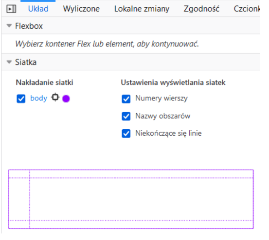

# Lab 6

### Zadanie 1
Napisz animację, która animuje logo Uniwersytetu Rzeszowskiego z wersji
standardowej w monochromatyczną (załączone w assetach). Wykorzystaj
właściwości _background-image_ i _background-size_.
- Niech animacja wykonuje się nieskończoną ilość razy (właściwość
_animation-iteration-count_) i trwa 6s. Niech animowany będzie w ten
sposób jeden div.

- Następnie dopisz animację, która po najechaniu na nią myszy
powiększy rozmiar obrazka dwukrotnie i która trwa 2s. Niech kolejny
div posiada tę animację.

- Następnie dodaj jeszcze jeden element div, który wyjściowo również
niech animuje się pomiędzy wersją monochromatyczną i barwną, ale
po najechaniu myszą obraca się dodatkowo o 360 stopni.

- Zastanów się, jak można za pomocą _animation-composition_ połączyć
działanie kilku animacji, bez konieczności pisania na nowo jednej
animacji, będącej "sumą" kilku niezależnych animacji.

### Zadanie 2

Wykonaj za pomocą CSS następujący spinner:

Wykorzystaj właściwość animation-timing-function aby animacja działała
płynnie.

### Zadanie 3
Zapoznaj się z przykładem, który definiuje zdefiniowany samodzielnie (tj.
przez autora strony) checkbox. Następnie dodaj animację, która po
aktywacji checkboxa:
- powiększy go dwukrotnie
- ustawi kolor kursora na zielony
- będzie trwała 2s, po czym dezaktywuje się

Następnie dodaj do formularza przycisk typu submit, który będzie
animowany w następujący sposób:
- obramowanie zmieni kolor na zielony
- przycisk powiększy się 120%
- przycisk będzie okrągły i jako tekst pojawi się: ✔

### Zadanie 4

Niech formularz z poprzedniego zadania dodatkowo wyświetla się w postaci
animowanej, tzn. rozwija się dynamicznie podczas animowania.
Skorzystaj z przykładu:[Przykład anmacji](https://codepen.io/ma_suwa/pen/eYdZVML)

### Zadanie 5
Zapoznaj się z przykładem _grid_areas.html_. W przykładzie tym
zdefiniowano najpierw właściwość _grid-template-areas_ w kontenerze
głównym, po czym kolejne elementy otrzymały odpowiednią wartość
właściwości _grid-area_.
- • W przeglądarce Firefox włącz następujący podgląd:

i zobacz jak strona została podzielona na obszary.
- Wykorzystując jednostkę _fr_ wymuś, aby kolumny były dokładnie sobie
równe na szerokość
- Następnie (choć nie ma to tutaj za dużo sensu użytkowego) ustaw
szerokość 1 kolumny na 5 razy większą niż drugiej.
- Powróć do stanu wyjściowego. Dopisz media query, które dla
urządzeń mobilnych zmieni grid na jednokolumnowy z czterema
wierszami. Niech _grid-template-areas_ pozostaną takie jakie były, ale
niech dostosują się do nowego układu. Niech również zarówno pasek
nawigacyjny, jak i mapa strony będą zwijalne/rozwijalne.

### Zadanie 6
Popularnym elementem występującym na stronach internetowych jest
slider. Jest to układ treści, w którym grupa elementów jest pokazywana
trochę na podobieństwo pokazu slajdów (stąd nazwa), tj. jeden z
elementów jest aktualnie widoczny, natomiast za pomocą przysików
nawigacyjnych możliwa jest jego zmiana na kolejny. Podobnym
rozwiązaniem jest carousel, gdzie jednocześnie widzimy kilka elementów i
również za pomocą przycisków nawigacyjnych możemy przełączać na
kolejne elementy, przy czym w carouselu zwykle nawigacja jest cykliczna,
tj. ostatni element przełączy widok z powrotem na pierwszy.

Poniżej zaprezentowano prosty slider:
- Zapoznaj się z przykładem i oceń, czy działa poprawnie zarówno w
przeglądarce Fireox i Chrome.
- Wykonaj modyikację, w której zmienisz styl linków nawigacyjnych z
postaci numerycznej na spotykane w tym kontekście zamalowywane
kropki.